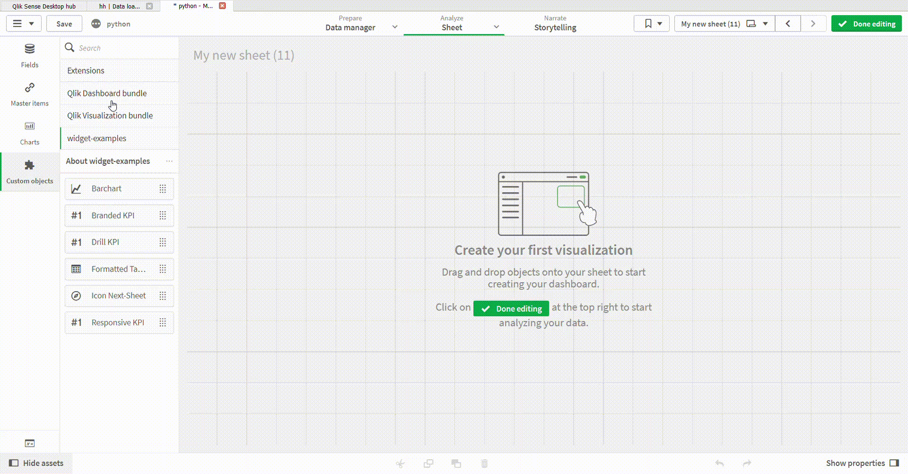
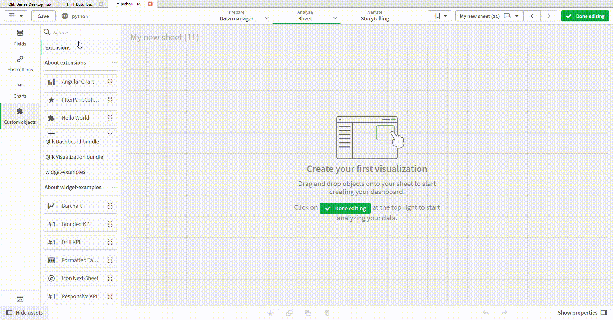
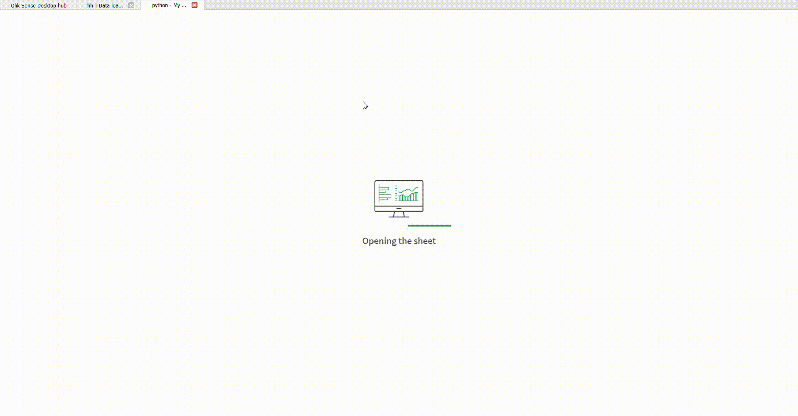

# filterPaneCollapsed
qlik sense filter pane that is always collapsed

The standard filterPane in qlik sense can expand and collapsed responsivly according to your placement on the canvas
the problem its not stable and not always fix as expected

this extension was a creation of newly hypercube that copy the beahvior of filterPane but without the expanding feature

# examples
**drag and drop**

**create more dimensions**

**allways collapsed**

